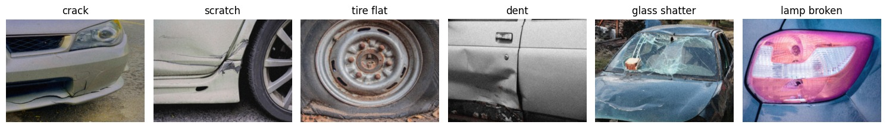
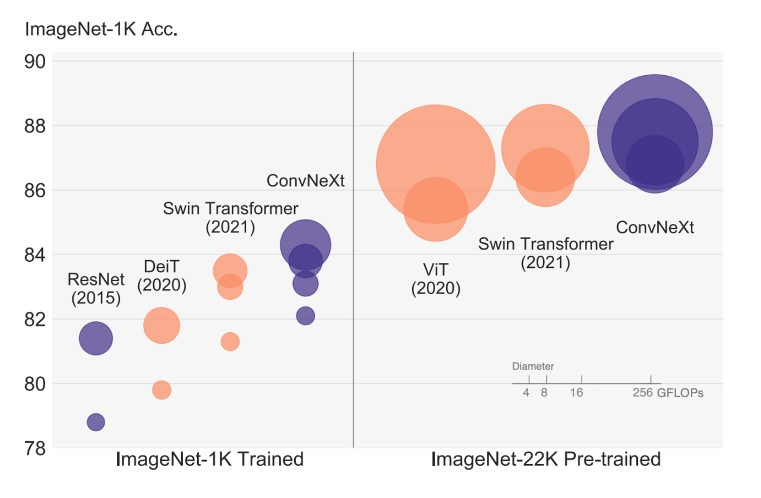
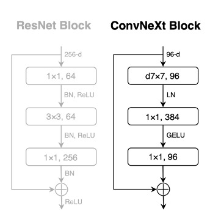
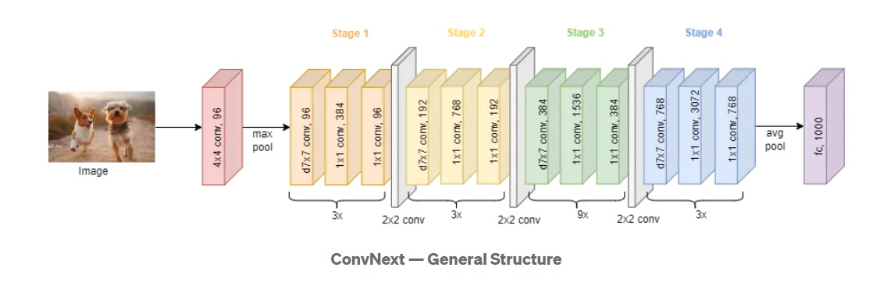
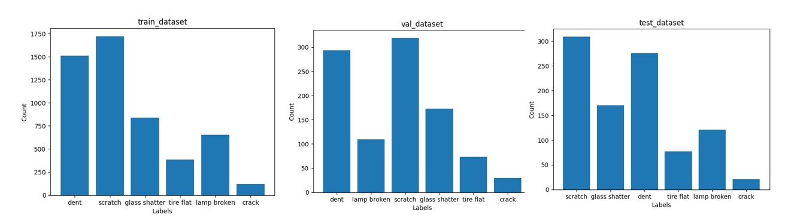
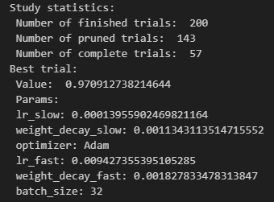
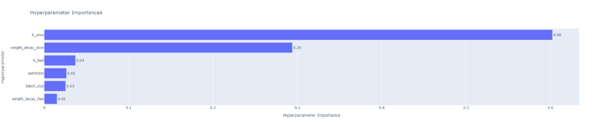
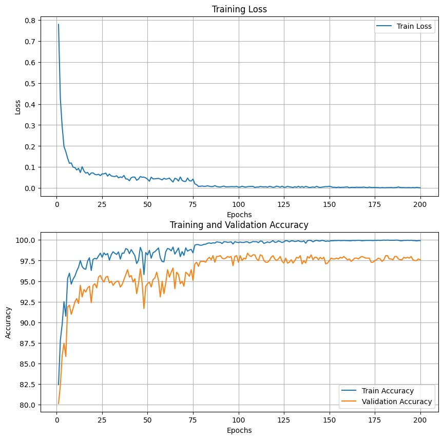
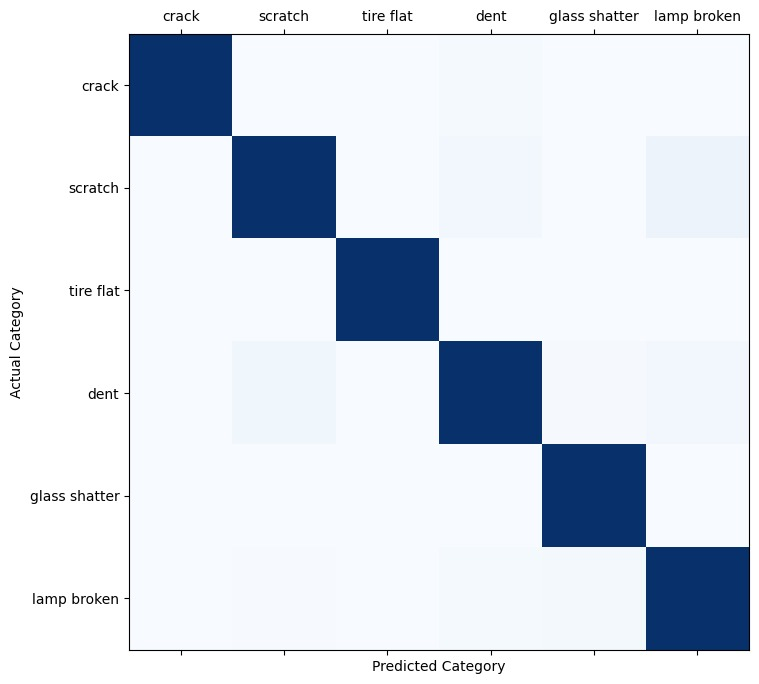

# Vehicle Damage Insurance Classification using ConvNeXt
Final project for the Technion's ECE Deep Learning course (046211)
 
Yarden Shavit
 
Dor Yogev
 
Ravid Goldenberg

  
# Introduction

This project aims to develop a deep learning model capable of identifying the type of damage from images of damaged vehicles. We utilize the ConvNeXt architecture and implement various techniques to achieve high accuracy in predictions.

# ConvNeXt

ConvNeXt is a state-of-the-art convolutional neural network architecture introduced by Facebook AI Research in 2022. It was designed to bridge the gap between convolutional neural networks (CNNs) and vision transformers (ViTs), combining the best aspects of both approaches.
Key features of ConvNeXt include:

Modernized CNN design: Incorporates advancements from vision transformers while maintaining the efficiency of CNNs.  
Improved performance: Achieves comparable or better accuracy than vision transformers on various computer vision tasks. 
Scalability: Offers different model sizes (Tiny, Small, Base, Large) to suit various computational requirements. 
Transfer learning capabilities: Pre-trained on large datasets, allowing for effective fine-tuning on specific tasks like our vehicle damage classification.

We chose ConvNext for this project due to its strong performance in image classification tasks and its ability to capture both local and global features effectively.

The ConvNeXt architecture is built hierarchically, with a basic block that includes a 7x7 CNN layer with 96 channels, followed by a Layer Norm, then an FC layer with 384 channels and GELU activation, and finally another FC layer with 96 channels. The block also includes skip connection from beginning to end. The main innovation of ConvNeXt is the use of FC layers in the block (not just CNN layers), as well as using Layer Norm instead of Batch Norm and GELU instead of ReLU. The diagram shows the differences between the ConvNeXt block and the ResNet block graphically.

The ConvNeXt network consists of 4 stages, each containing a different number of blocks depending on the size of the chosen model. Between each stage and at the network's input, there are downsampling layers.We used ConvNeXt_Tiny model, which has 28 million parameters and performs 4.5 GigaFLOPs. This model contains 3 blocks in its first two stages, 9 blocks in the third stage, and 3 blocks in the last stage. due to memory constraints we only fine tuned the last stage and switched the last fc for a new fc layer with 6 outputs , the number of out labels.

# Dataset:
We use the Vehicle Damage Insurance Verification dataset from Kaggle. This dataset provides a comprehensive collection of vehicle damage images for training and testing our model.

The dataset comprises 7,000 images, categorized into six distinct classes: 
Dent,
Scratch,
Crack,
Glass Shatter,
Lamp Broken,
Tire Flat.

we took the dataset, consisting of 7,000 labeled images, and split it into train, validation, and test sets. It's important to note that the original Kaggle dataset contains 7,000 labeled images for training and an additional 5,000 unlabeled images for testing. Therefore, we had to take all the labeled images and split them ourselves. We divided them into 5,000 images for training, 1,000 for validation, and 1,000 for testing. Below is the distribution of the images, which shows that the original dataset is not evenly distributed.

# Method
1. use optuna for optimized hyper parametrs.  
2. use data augmanatations for increasing train set sample.   
3. fine tune last satge and last FC layer , using DORA for FC layers , note that we optimzed the last FC layer with one optimizer and the last stage with another.   

# Results

### Hyperparameter Optimization

We used Optuna, an automatic hyperparameter optimization framework, to find the best hyperparameters for our model. Optuna employs efficient search algorithms to explore the hyperparameter space and find the optimal configuration.

Our Optuna trials yielded the following optimal hyperparameters :

Also from Optuna analysis we understood the impotance of using 2 optimizers for the last stage and the last fc , as we can see lr_slow and weight_decay_slow , the last stage optimizers' parameters , were the most important.

### Final Model Performance

Using the optimal hyperparameters found by Optuna and addition of a schedualer - MultiStepLR (decreasing learning rate by 0.1 after 75 and 150 epochs), our final model achieved the following results:

**train accuracy: 99.771%**

**validation accuracy: 98.395%**

**test accuracy: 97.328%** 

**confusion matrix:**

# Usage
1. Dataset Preparation:
   - `dataset.py` preprocess and organize your data.

2. Data Normalization:
   - Execute `calculate_normalize_mean_std.ipynb` to compute normalization parameters for train set.

3. Model Training:
   - Execute `train.ipynb` to train the ConvNext model on your dataset.

4. Evaluation and Results:
   - Execute `results.ipynb` to evaluate the model's performance and generate result metrics.

5. Hyperparameter Tuning:
   - If needed, Execute `tune_hyper_parameters.ipynb` to optimize model hyperparameters.

6. Model maintenance:
   - `model.py` handles the models custom architecture , adds DORA and modifys last fc layer .

7. Model architecture:
   - `convnext.py` is the pre trained model architecture.

# Future Work

- Experiment with additional architectures
- Implement more advanced data augmentation techniques
- Optimize model for deployment in real-world scenarios
  
# References:

dataset:

[https://www.kaggle.com/datasets/mrgeislinger/asl-rgb-depth-fingerspelling-spelling-it-out?resource=download](https://www.kaggle.com/datasets/sudhanshu2198/ripik-hackfest/data)

ConvNeXt:

https://github.com/facebookresearch/ConvNeXt

